# AI VTuber Agent

A Flutter Desktop (Windows) AI VTuber application that combines a live 2D/3D character, Bilibili streaming, TTS voice, and a WenzAgent multi-agent network. It reproduces the LocalAIVtuber2 React + shadcn/ui visual language and extends it with employee personas, viewer-dispatched agent tasks, and A/I/U/E/O viseme lip-sync.

## Screenshots

| Page | Preview |
|------|---------|
| Home / Chat | 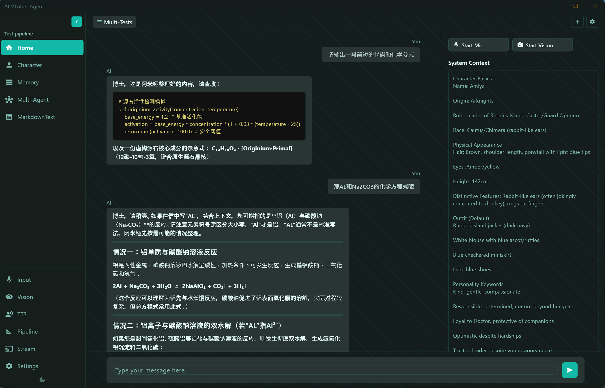 |
| Character (Live2D / VRM) | 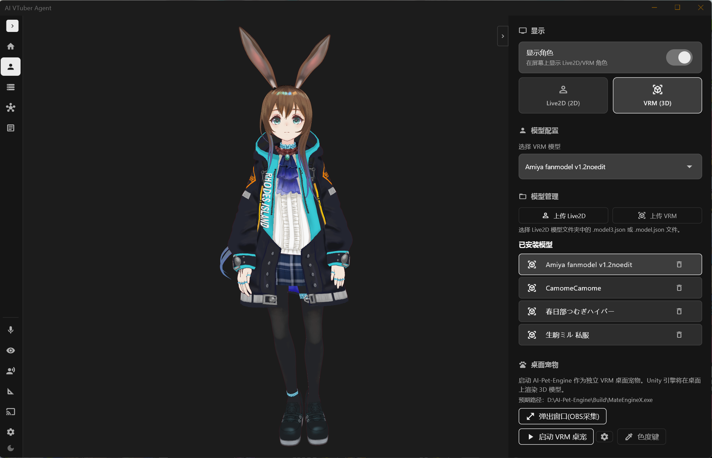 |
| TTS | 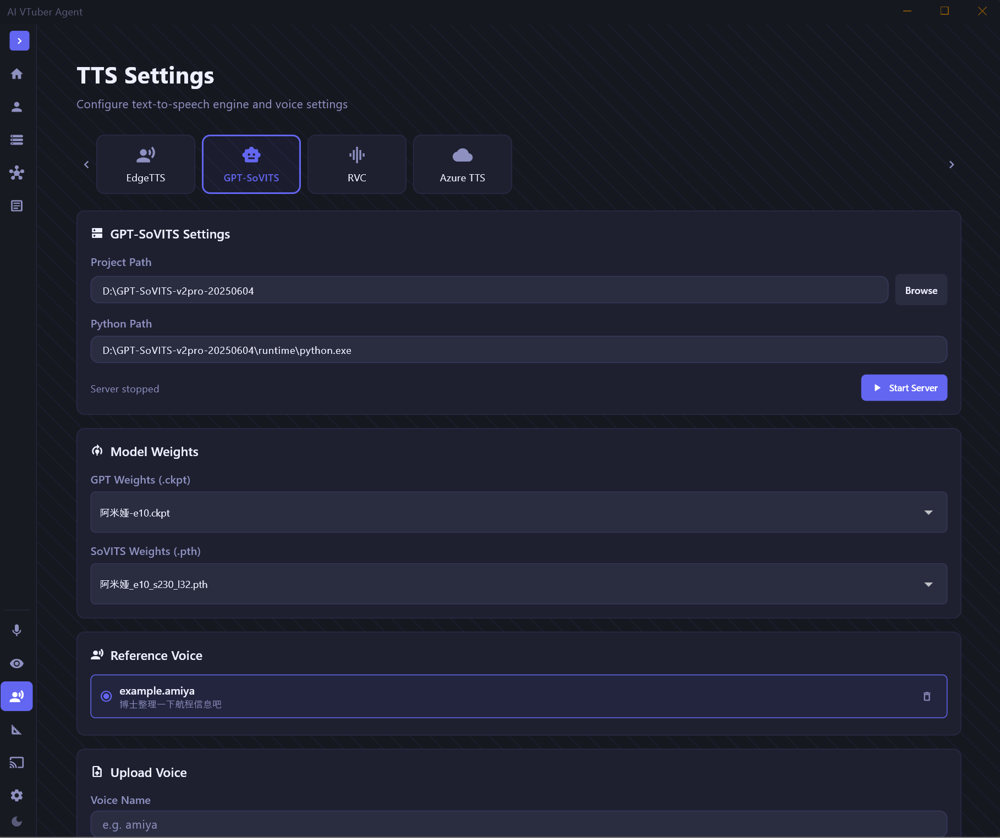 |
| Memory | 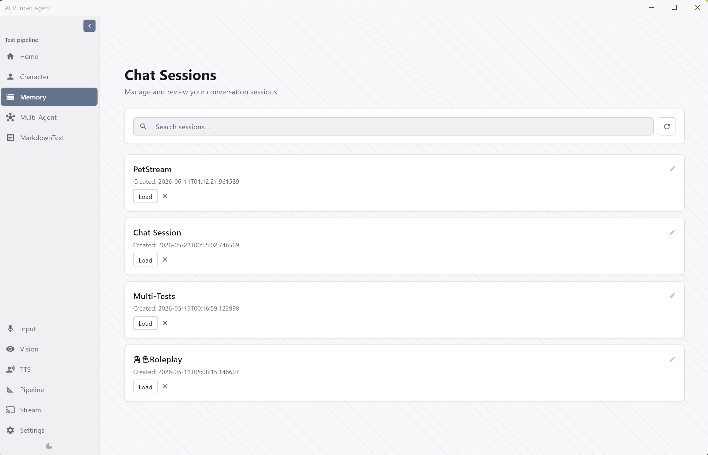 |
| Stream | 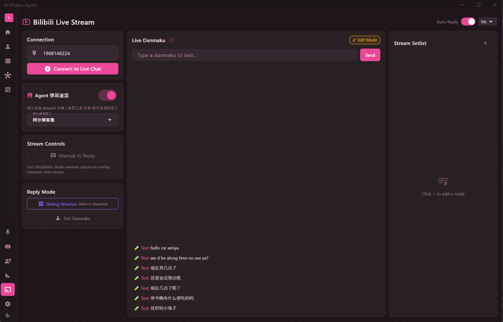 |
| Pipeline Monitor | 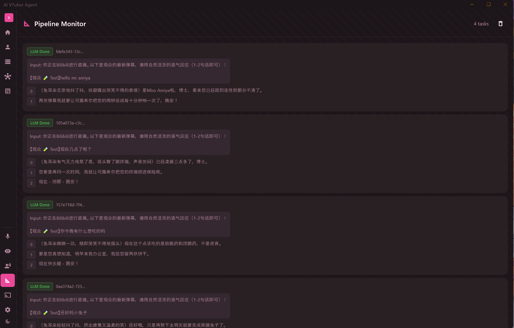 |
| Multi-Agent Employee Session | 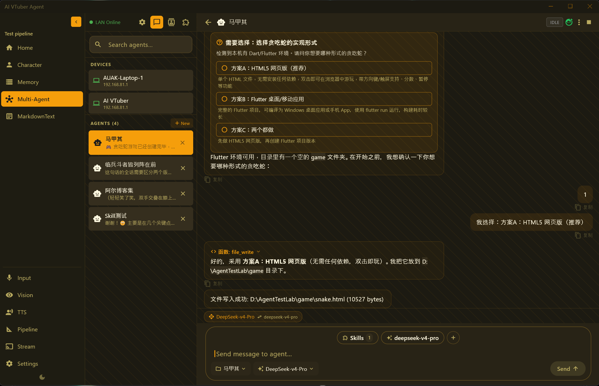 |
| Multi-Agent Settings | 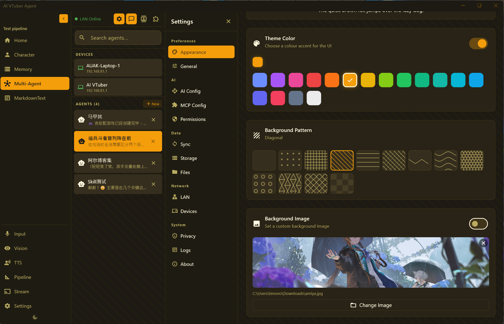 |
| Multi-Agent Data Sync | 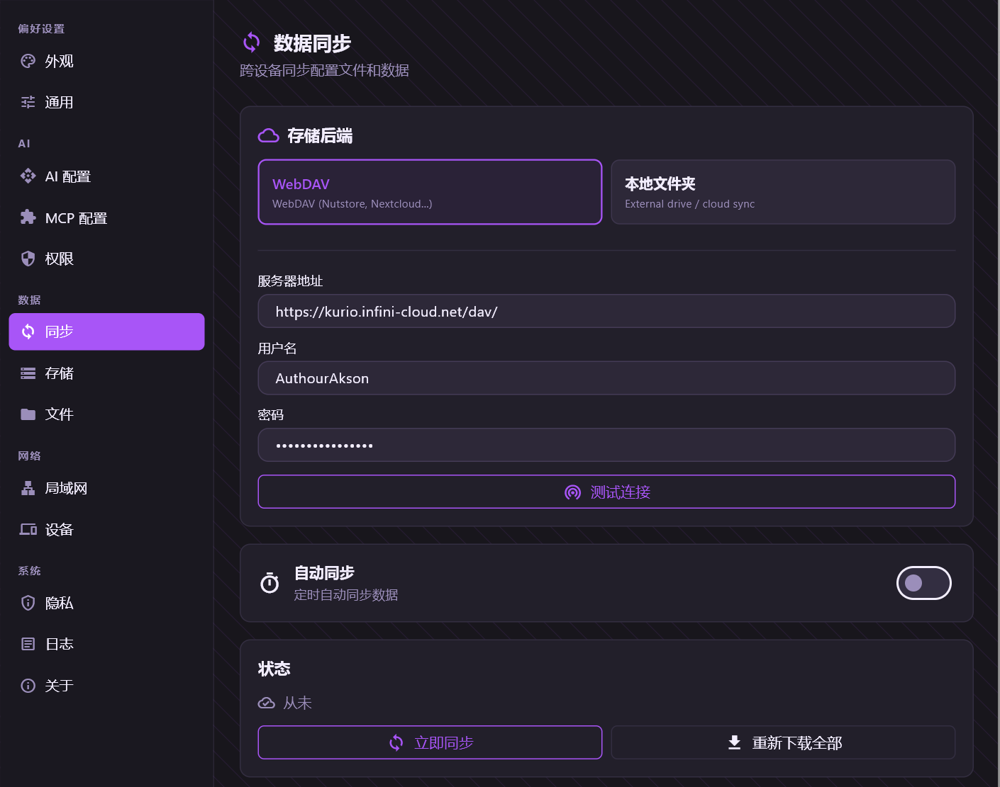 |
| MarkdownText IDE 1 | 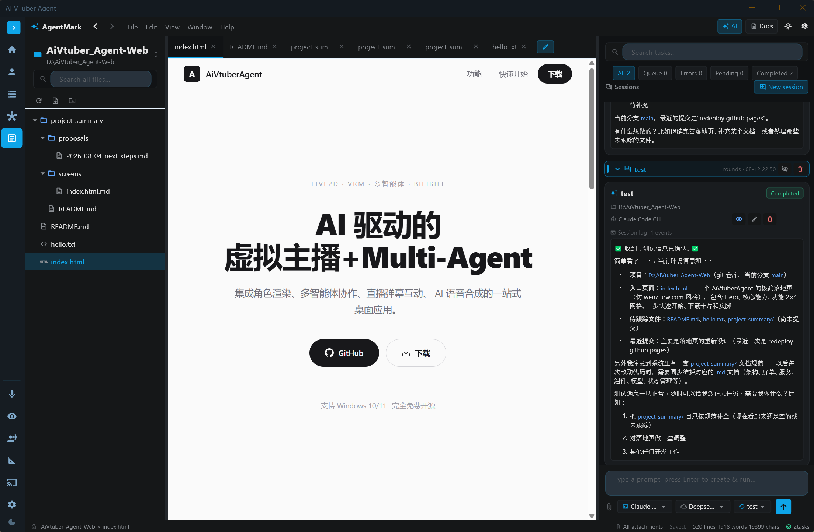 |
| MarkdownText IDE 2 | 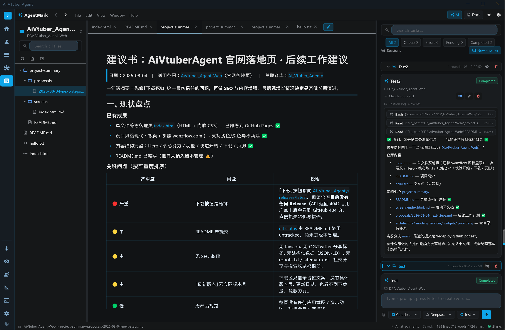 |
| MarkdownText IDE 3 | 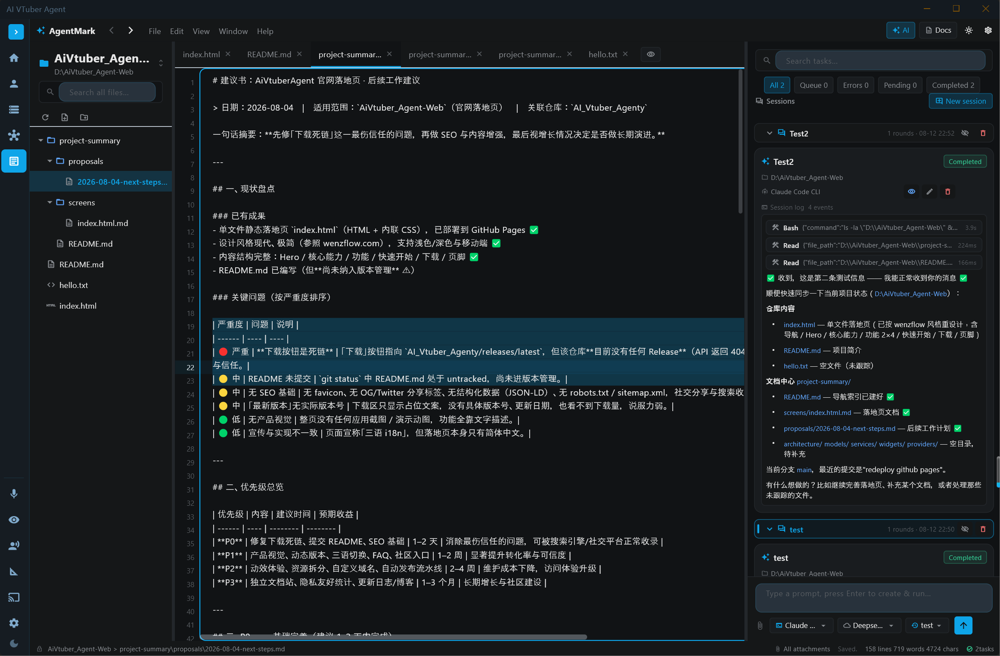 |

## Features

### AI Chat & Character
- Streaming LLM chat with OpenAI-compatible APIs (SiliconFlow / OpenRouter / Anthropic / Google / Ollama)
- Live2D and VRM 3D character rendering with WebView + PixiJS / Three.js
- Edge-TTS and GPT-SoVITS voice synthesis with local audio cache
- OBS pop-out character window with chroma-key background
- A/I/U/E/O viseme mouth animation for VRM, plus volume-based mouth animation for Live2D

### Bilibili Streaming
- Bilibili danmaku polling, auto reply, sliding-window / sequential reply modes
- Setlist editor (system prompt / AI reply / chat / sing nodes)
- Viewer can dispatch tasks directly to WenzAgent employees:
  - `@employee-name task`
  - `@agent task`
  - `!agent task`
- Agent confirm requests are announced by TTS and can be answered by viewers via danmaku (`1` / `2` / option name)

### WenzAgent Multi-Agent
- LAN device / employee management
- AI employee personas: bind each employee to a Live2D or VRM avatar, voice, and system prompt
- Confirm tool requests rendered as clickable choice cards
- Agent replies can be spoken with the employee's bound voice
- WebDAV / local-folder data sync with incremental content-hash upload

### MarkdownText IDE
- Project document workspace with file tree, Markdown editor, and AI task center
- Employees / Claude Code CLI executors
- Structured streaming task events with tool progress

### Other
- Vision screenshot OCR
- Local memory search
- Pipeline monitor
- 16 shadcn-style theme presets
- i18n: English / Simplified Chinese / Traditional Chinese

## Tech Stack

- **Frontend:** Flutter Desktop (Windows)
- **State:** Provider (ChangeNotifier)
- **UI:** ShadTheme (shadcn/ui style, Material 3 base)
- **Window:** bitsdojo_window + flutter_acrylic
- **Live2D:** PixiJS + Live2D Cubism SDK
- **VRM:** Three.js + @pixiv/three-vrm
- **TTS:** edge-tts CLI / GPT-SoVITS HTTP API + ffmpeg
- **Multi-Agent:** WenzAgent Dart SDK (LAN)
- **Storage:** `D:\AiVtuber_Agent_profile\` local JSON/SQLite data

## Quick Start

```bash
cd D:\AiVtuber_Agent
flutter pub get
flutter run -d windows
```

## Profile Data

```
D:\AiVtuber_Agent_profile\
├── settings.json              # LLM / TTS / character settings
├── sessions\                   # Chat session JSON files
├── tts_cache\                  # Cached TTS audio
├── screenshots\                # Vision screenshots
├── models\live2d\              # Live2D models
├── models\vrm\                 # VRM models
├── wenzagent\                  # WenzAgent SDK data
└── wenzagent_profiles.json     # Multi-agent profiles + employee personas
```

## Development

```bash
flutter pub get
flutter run -d windows
flutter build windows --release
```
