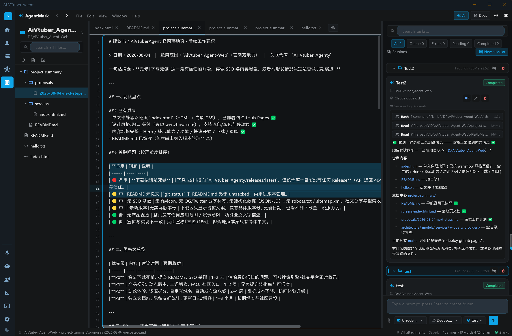

# AI VTuber Agent

[English](README.md) | [简体中文](README.zh-CN.md)

一个基于 **Flutter Desktop (Windows)** 的 AI VTuber 应用，集成了 Live2D/VRM 角色、Bilibili 直播、TTS 语音和 WenzAgent 多智能体网络。界面复刻 LocalAIVtuber2 的 React + shadcn/ui 视觉风格，并扩展了员工人格化、观众弹幕派活和 A/I/U/E/O 口型同步能力。

## 页面截图

| 页面 | 预览 |
|------|------|
| 首页 / 聊天 |  |
| 角色（Live2D / VRM） |  |
| TTS 语音 |  |
| 记忆 |  |
| 直播 |  |
| 流水线监控 |  |
| 多智能体员工会话 |  |
| 多智能体设置 |  |
| 多智能体数据同步 |  |
| MarkdownText IDE 1 |  |
| MarkdownText IDE 2 |  |
| MarkdownText IDE 3 |  |
| MarkdownText IDE 4 |  |

## 功能特性

### AI 聊天与角色
- 兼容 OpenAI API 的流式 LLM 聊天（SiliconFlow / OpenRouter / Anthropic / Google / Ollama）
- Live2D / VRM 3D 角色渲染（WebView + PixiJS / Three.js）
- Edge-TTS / GPT-SoVITS 语音合成 + 本地缓存
- OBS 弹窗角色窗口（支持色度键背景）
- VRM 支持 A/I/U/E/O 口型动画，Live2D 支持音量驱动张嘴

### Bilibili 直播
- Bilibili 弹幕轮询、自动回复、滑动窗口/顺序回复模式
- Setlist 编辑器（系统提示 / AI 回复 / 聊天 / 唱歌节点）
- 观众可直接向 WenzAgent 员工派发任务：
  - `@员工名 任务内容`
  - `@agent 任务内容`
  - `!agent 任务内容`
- Agent 的确认请求会通过 TTS 播报，观众可用弹幕 `1` / `2` / 选项名进行选择

### WenzAgent 多智能体
- LAN 设备 / 员工管理
- AI 员工人格化：为每个员工绑定 Live2D/VRM 形象、音色和系统提示词
- confirm 工具渲染为可点击选项卡片
- Agent 回复可以使用员工绑定音色播报
- WebDAV / 本地文件夹增量同步（内容哈希去重）

### MarkdownText IDE（AgentMark）
- 项目文档工作台：文件树 + Markdown 编辑器 + AI 任务中心
- 支持员工 / Claude Code CLI 执行器
- 结构化流式任务事件与工具进度

### 其他
- 截图视觉识别 / OCR
- 本地记忆搜索
- 流水线监控
- 16 套 shadcn 风格主题
- i18n：英文 / 简体中文 / 繁体中文

## 技术栈

- **前端：** Flutter Desktop (Windows)
- **状态管理：** Provider (ChangeNotifier)
- **UI：** ShadTheme（shadcn/ui 风格，Material 3 基座）
- **窗口：** bitsdojo_window + flutter_acrylic
- **Live2D：** PixiJS + Live2D Cubism SDK
- **VRM：** Three.js + @pixiv/three-vrm
- **TTS：** edge-tts CLI / GPT-SoVITS HTTP API + ffmpeg
- **多智能体：** WenzAgent Dart SDK (LAN)
- **存储：** `D:\AiVtuber_Agent_profile\` 本地 JSON / SQLite 数据

## 快速开始

```bash
cd D:\AiVtuber_Agent
flutter pub get
flutter run -d windows
```

## 数据目录

```
D:\AiVtuber_Agent_profile\
├── settings.json              # LLM / TTS / 角色设置
├── sessions\                   # 聊天会话 JSON
├── tts_cache\                  # TTS 音频缓存
├── screenshots\                # 截图
├── models\live2d\              # Live2D 模型
├── models\vrm\                 # VRM 模型
├── wenzagent\                  # WenzAgent SDK 数据
└── wenzagent_profiles.json     # 多智能体配置 + 员工人格化数据
```

## 开发

```bash
flutter pub get
flutter run -d windows
flutter build windows --release
```
